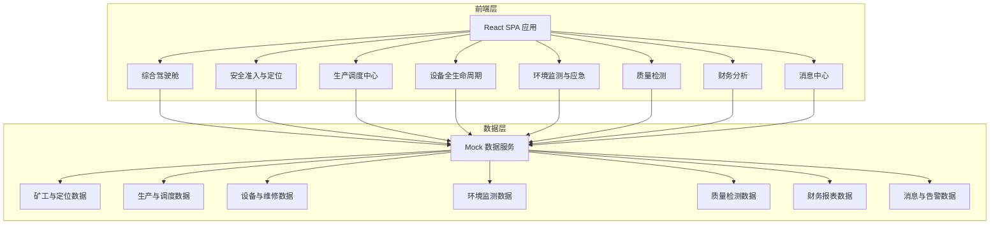
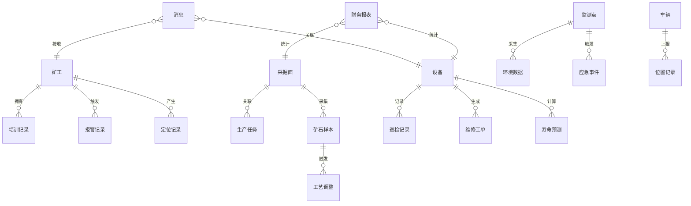

## 1. 架构设计



## 2. 技术说明

- **前端**：React@18 + TypeScript + Tailwind CSS@3 + Vite
- **初始化工具**：Vite（react-ts 模板）
- **UI组件库**：Ant Design@5（企业级组件丰富）
- **图表库**：ECharts@5（丰富的工业级图表，适合仪表盘）
- **路由**：React Router@6
- **状态管理**：Zustand（轻量高效）
- **后端**：无后端，使用 Mock 数据模拟
- **数据库**：无数据库，前端内存数据 + localStorage 持久化

## 3. 路由定义

| 路由 | 用途 |
|------|------|
| / | 综合驾驶舱（首页） |
| /safety/access | 安全准入 - 矿工准入列表与验证 |
| /safety/access/:id | 安全准入 - 准入详情 |
| /safety/positioning | 人员定位 - 井下地图与追踪 |
| /safety/alarms | 人员定位 - 报警记录 |
| /production/monitor | 生产调度 - 采掘面监控 |
| /production/vehicles | 生产调度 - 车辆追踪与路线优化 |
| /production/tasks | 生产调度 - 任务单管理 |
| /equipment/list | 设备管理 - 设备台账 |
| /equipment/inspection | 设备管理 - 巡检记录 |
| /equipment/prediction | 设备管理 - 故障预测 |
| /equipment/workorders | 设备管理 - 维修工单 |
| /environment/monitor | 环境监测 - 实时监控 |
| /environment/thresholds | 环境监测 - 阈值管理 |
| /environment/emergency | 环境监测 - 应急管理 |
| /quality/samples | 质量检测 - 样本管理 |
| /quality/grade | 质量检测 - 品位判定 |
| /quality/params | 质量检测 - 选矿参数 |
| /finance/production | 财务分析 - 产量统计 |
| /finance/cost | 财务分析 - 成本分析 |
| /finance/report | 财务分析 - 利润报表 |
| /messages | 消息中心 |

## 4. API定义（Mock数据接口）

### 4.1 安全准入相关
```typescript
interface Miner {
  id: string;
  name: string;
  employeeId: string;
  team: string;
  healthStatus: 'normal' | 'abnormal';
  healthData: {
    bloodPressure: string;
    heartRate: number;
    bloodOxygen: number;
    lastCheckup: string;
  };
  trainingRecords: {
    id: string;
    course: string;
    completedAt: string;
    validUntil: string;
    passed: boolean;
  }[];
  accessStatus: 'approved' | 'rejected' | 'pending';
  currentPosition: { x: number; y: number; zone: string } | null;
  isUnderground: boolean;
}

interface AlarmRecord {
  id: string;
  minerId: string;
  minerName: string;
  zone: string;
  type: 'danger_zone' | 'over_time' | 'distress';
  level: 'warning' | 'critical' | 'emergency';
  message: string;
  rescueCommand: string;
  timestamp: string;
  resolved: boolean;
}
```

### 4.2 生产调度相关
```typescript
interface MiningFace {
  id: string;
  name: string;
  type: 'coal' | 'metal';
  dailyTarget: number;
  currentOutput: number;
  unit: string;
  status: 'active' | 'idle' | 'maintenance';
  oreGrade: number;
}

interface Vehicle {
  id: string;
  plateNumber: string;
  type: 'shovel' | 'transport' | 'auxiliary';
  status: 'running' | 'idle' | 'maintenance';
  position: { x: number; y: number };
  route: { x: number; y: number }[];
  optimizedRoute: { x: number; y: number }[];
  loadCapacity: number;
  currentLoad: number;
  driver: string;
}

interface ProductionTask {
  id: string;
  date: string;
  miningFaceId: string;
  target: number;
  assigned: string[];
  status: 'draft' | 'issued' | 'in_progress' | 'completed';
  priority: 'high' | 'medium' | 'low';
}
```

### 4.3 设备管理相关
```typescript
interface Equipment {
  id: string;
  name: string;
  model: string;
  type: string;
  installDate: string;
  status: 'running' | 'idle' | 'warning' | 'fault' | 'maintenance';
  location: string;
  remainingLife: number;
  healthScore: number;
}

interface InspectionRecord {
  id: string;
  equipmentId: string;
  inspector: string;
  timestamp: string;
  vibration: number;
  temperature: number;
  notes: string;
}

interface MaintenanceOrder {
  id: string;
  equipmentId: string;
  equipmentName: string;
  type: 'preventive' | 'corrective' | 'emergency';
  priority: 'high' | 'medium' | 'low';
  status: 'pending' | 'in_progress' | 'completed';
  predictedFault: string;
  recommendedParts: { name: string; stock: number; partNumber: string }[];
  createdAt: string;
  scheduledAt: string;
}
```

### 4.4 环境监测相关
```typescript
interface MonitorPoint {
  id: string;
  name: string;
  location: string;
  gasConcentration: number;
  dustConcentration: number;
  gasThreshold: number;
  dustThreshold: number;
  status: 'normal' | 'warning' | 'critical';
  history: { timestamp: string; gas: number; dust: number }[];
}

interface EmergencyEvent {
  id: string;
  type: 'gas_over' | 'dust_over' | 'collapse' | 'flood';
  level: 'warning' | 'critical' | 'emergency';
  location: string;
  description: string;
  evacuationZones: string[];
  broadcastContent: string;
  timestamp: string;
  status: 'active' | 'resolved';
  reportUrl?: string;
}
```

### 4.5 质量检测相关
```typescript
interface OreSample {
  id: string;
  sampleDate: string;
  location: string;
  collector: string;
  data: {
    feContent: number;
    sContent: number;
    moisture: number;
    granularity: number;
  };
  grade: 'premium' | 'grade_a' | 'grade_b' | 'grade_c' | 'low' | null;
  gradeScore: number;
  processParams: Record<string, number>;
}

interface ProcessAdjustment {
  id: string;
  sampleId: string;
  parameter: string;
  oldValue: number;
  newValue: number;
  reason: string;
  timestamp: string;
  operator: string;
}
```

### 4.6 财务相关
```typescript
interface FinanceReport {
  id: string;
  period: string;
  teamOutputs: { team: string; output: number; target: number }[];
  maintenanceCosts: { category: string; amount: number }[];
  energyConsumption: { month: string; electricity: number; water: number; fuel: number }[];
  totalRevenue: number;
  totalCost: number;
  profit: number;
  profitMargin: number;
}

interface Message {
  id: string;
  type: 'access' | 'alarm' | 'fault' | 'quality' | 'dispatch' | 'emergency' | 'report';
  title: string;
  content: string;
  sender: string;
  recipients: string[];
  timestamp: string;
  read: boolean;
  hasVoucher: boolean;
  voucherUrl?: string;
  level: 'info' | 'warning' | 'error' | 'critical';
}
```

## 5. 服务器架构图

本项目为纯前端应用，无后端服务器。所有数据通过 Mock 数据服务在浏览器端模拟。

## 6. 数据模型

### 6.1 数据模型定义



### 6.2 数据存储策略
- 使用 TypeScript 文件导出 Mock 数据常量
- 关键操作状态通过 Zustand store 管理
- 用户偏好与阈值设定持久化至 localStorage
